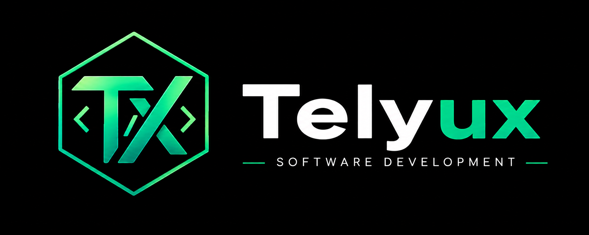

# 🏆 TORNALYX - Sistema de Gestión Deportiva Modular

<div align="center">



### Plataforma modular para la gestión de torneos deportivos, mentales y electrónicos

**Proyecto de Bachillerato Tecnológico - Tecnologías de la Información 2026**

Desarrollado por **Telyux Software Development**

</div>

---

## 📖 Descripción

SGDM (Sistema de Gestión Deportiva Modular) es una plataforma web diseñada para la organización, administración y seguimiento de competencias deportivas, mentales y electrónicas.

El sistema permite gestionar distintos formatos de torneos desde una única plataforma, evitando el uso de planillas manuales o herramientas separadas para cada disciplina.

Su arquitectura modular permite adaptar el comportamiento del sistema a diferentes tipos de competencia, facilitando la reutilización de componentes y la escalabilidad del proyecto.

---

## 🎯 Objetivo

Desarrollar una plataforma web modular que permita:

* Administrar participantes y equipos.
* Crear y gestionar torneos.
* Automatizar emparejamientos.
* Registrar resultados.
* Generar tablas de posiciones y clasificaciones.
* Publicar información de forma accesible para participantes y espectadores.
* Implementar distintos sistemas de competencia mediante módulos independientes.

---

## ✨ Características Principales

### Gestión de Usuarios

* Registro e inicio de sesión.
* Control de acceso basado en roles.
* Administración de perfiles.

### Gestión de Participantes

* Alta, baja y modificación de participantes.
* Gestión de equipos.
* Historial de participación.

### Gestión de Torneos

* Creación y configuración de torneos.
* Administración de rondas.
* Configuración de reglas básicas.

### Módulos de Competencia

#### Liga

* Generación automática de calendario.
* Tabla de posiciones.
* Estadísticas básicas.

#### Eliminación Directa

* Generación de llaves.
* Avance automático de rondas.
* Visualización gráfica de enfrentamientos.

#### Sistema Suizo

* Emparejamiento automático según rendimiento.
* Evita enfrentamientos repetidos.
* Clasificación dinámica.

### Resultados

* Registro de resultados.
* Modificación controlada.
* Validación de datos.

### Consulta Pública

* Calendarios.
* Resultados.
* Posiciones.
* Llaves de torneo.

---

## 👥 Roles del Sistema

### Administrador General

* Gestión completa del sistema.
* Administración de usuarios.
* Configuración de torneos.
* Auditoría y reportes.

### Organizador de Torneo

* Administración de torneos asignados.
* Gestión de participantes.
* Generación de rondas.
* Registro de resultados.

### Participante

* Consulta de torneos.
* Visualización de resultados.
* Consulta de posiciones.
* Gestión básica de perfil.

### Usuario Público

* Consulta de torneos publicados.
* Visualización de resultados.
* Consulta de calendarios.
* Acceso a información pública.

---

## 🏗 Arquitectura

El proyecto sigue el patrón de diseño **MVC (Modelo - Vista - Controlador)**.

```text
┌─────────────┐
│    Vista    │
└──────┬──────┘
       │
       ▼
┌─────────────┐
│ Controlador │
└──────┬──────┘
       │
       ▼
┌─────────────┐
│   Modelo    │
└─────────────┘
       │
       ▼
┌─────────────┐
│   MySQL     │
└─────────────┘
```

---

## 🛠 Tecnologías Utilizadas

### Frontend

* HTML5
* CSS3
* JavaScript
* JSON

### Backend

* PHP 8+

### Base de Datos

* MySQL

### DevOps

* Docker
* Docker Compose
* Git
* GitHub

### Infraestructura

* Apache
* Linux

---

## 📂 Estructura del Proyecto

El proyecto está organizado por capas del patrón **MVC**. Cada capa es una
carpeta de primer nivel dentro de `SGDM/`, y todas viven **fuera** del
DocumentRoot: Apache solo puede servir lo que hay en `publico/`.

```text
SGDM/
│
├── publico/              # DocumentRoot de Apache (lo ÚNICO servible por URL)
│   ├── index.php          # Front controller: recibe todo y enruta
│   ├── .htaccess          # Reescritura al front controller + cabeceras
│   ├── css/
│   ├── js/
│   └── assets/
│
├── vista/                # ── V ── Todas las páginas y plantillas
│   ├── paginas/           # Públicas: index, login, torneos, jugadores…
│   ├── paneles/           # Privadas: perfil y dashboards (con guardia de rol)
│   ├── parciales/         # Fragmentos reutilizables (nav-publico)
│   ├── docs/              # Documentación por materia
│   ├── documentacion.php  # Plantillas con lógica de servidor
│   └── doc-aprobacion.php
│
├── controlador/          # ── C ── Recibe la petición y decide qué responder
│   ├── PaginaController.php   # Sirve las vistas .html (y valida el rol)
│   ├── AuthController.php     # Login, registro, 2FA, logout
│   ├── TorneoController.php
│   ├── InscripcionController.php
│   ├── PartidoController.php
│   ├── PerfilController.php
│   ├── AvisoController.php
│   ├── DocsController.php
│   └── AdminController.php
│
├── modelo/               # ── M ── Todo lo que habla con la base de datos
│   ├── Conexion.php       # PDO + carga del .env (antes config/database.php)
│   ├── Model.php          # Clase base: CRUD genérico y conexión perezosa
│   ├── Usuario.php  Torneo.php  Partido.php  Inscripcion.php  Equipo.php
│   ├── Resultado.php  Posicion.php  Aviso.php  Estadistica.php
│   ├── OtpModel.php  OtpCode.php  DocOtp.php  DocAcceso.php
│   └── Migracion.php      # Aplica sola las migraciones pendientes
│
├── nucleo/               # Infraestructura del MVC (no es una capa de negocio)
│   ├── Router.php         # Tabla de rutas del front controller
│   ├── Controller.php     # Controlador base: JSON, vistas, autorización
│   └── View.php           # Motor de plantillas + servido de vistas .html
│
├── comun/                # Servicios transversales
│   ├── Session.php        # Sesión, roles, CSRF, expiración por inactividad
│   ├── Mailer.php         # Correo transaccional (SMTP o API de Brevo)
│   ├── LoginThrottle.php  # Límite de intentos (fuerza bruta / enumeración)
│   └── Fixture.php        # Generación de emparejamientos (lógica pura)
│
├── base_datos/           # Esquema, DCL y migraciones
│   ├── dcl.sql            # Usuarios de MySQL con privilegios mínimos
│   ├── probar_motor.php
│   └── migrations/
│
├── almacenamiento/       # Estado temporal que escribe la app (no se versiona)
│
├── scripts/              # Administración del servidor (Bash) — ver su README
│
└── docker/
```

### Por dónde pasa una petición

```text
Navegador
   │
   ▼
.htaccess ──► publico/index.php ──► Router ──► Controlador ──► Modelo ──► MySQL
                (front controller)                  │
                                                    ▼
                                                  Vista  ──►  HTML
```

Nada saltea ese camino. Una vista `.html` no se puede pedir por su nombre de
archivo porque no está en el DocumentRoot: la única forma de verla es que un
controlador decida mostrarla, y eso es lo que hace que la guardia de sesión de
`/perfil` o `/admin/dashboard` no se pueda esquivar.

---

## 🚀 Instalación

### Clonar el repositorio

```bash
git clone https://github.com/telyuxsoftwaredevelopment-tech/TORNALIX.git
cd TORNALIX
```

### Configurar variables de entorno

```env
DB_HOST=localhost
DB_PORT=3306
DB_NAME=sgdm
DB_USER=root
DB_PASSWORD=password
```

### Levantar el entorno con Docker

```bash
docker compose up -d
```

### Acceder a la aplicación

```text
http://localhost
```

---

## 🔒 Seguridad

El sistema implementa medidas basadas en OWASP Top 10:

* Validación de entradas.
* Sanitización de datos.
* Control de acceso por roles.
* Hashing de contraseñas.
* Protección contra SQL Injection.
* Protección contra XSS.
* Gestión segura de sesiones.
* Registro de auditoría.

---

## 📊 Base de Datos

Entidades principales:

* Usuario
* Rol
* Participante
* Equipo
* Torneo
* TipoTorneo
* Ronda
* Enfrentamiento
* Resultado
* TablaPosiciones
* ConfiguraciónTorneo
* Auditoría

---

## 📚 Documentación

La documentación del proyecto se encuentra en la carpeta:

```text
docs/
```

Incluye:

* Documentación funcional.
* Documentación técnica.
* Manual de usuario.
* Manual de administrador.
* Documentación de seguridad.
* Diagramas UML.
* Modelo Entidad-Relación.

---

## 🧪 Testing

Pruebas contempladas:

* Testing funcional.
* Testing de integración.
* Testing de usabilidad.
* Testing de seguridad.
* Validación de requisitos.

---

## 🤝 Equipo de Desarrollo

### Telyux Software Development

Empresa creada para el desarrollo del proyecto de egreso de Bachillerato Tecnológico en Tecnologías de la Información.

---

## 📄 Licencia

Proyecto académico desarrollado con fines educativos.

© 2026 Telyux Software Development - Todos los derechos reservados.
